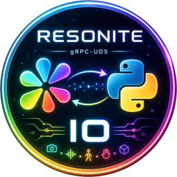

<p align="center">
  
</p>

<h1 align="center">ResoniteIO</h1>

<p align="center">Turn <a href="https://resonite.com/">Resonite</a> into a runtime environment for AI agents.</p>

<p align="center">
  <a href="https://thunderstore.io/c/resonite/p/mlshukai/ResoniteIO/"></a>
</p>

<p align="center">
  <a href="https://pypi.org/project/resoio/"></a>
  <a href="https://pypi.org/project/resoio/"></a>
  <a href="LICENSE"></a>
  <a href="https://github.com/MLShukai/ResoniteIO/actions/workflows/test.yml"></a>
  <a href="https://github.com/MLShukai/ResoniteIO/actions/workflows/type-check.yml"></a>
  <a href="https://github.com/MLShukai/ResoniteIO/actions/workflows/dotnet.yml"></a>
</p>

______________________________________________________________________

**ResoniteIO** is a bidirectional IPC bridge that lets AI agents see, hear, speak, move, and
act inside [Resonite](https://resonite.com/). A C# mod runs inside the Resonite client and a
Python package (`resoio`) runs wherever your agent code lives; they talk to each other over
**gRPC on a Unix Domain Socket**.

It is designed like **real-time robotics middleware, not a reinforcement-learning
environment**: there is no `Observation` / `Action` abstraction and no global `step()`.
Each capability is an independent, asynchronous **modality** stream carrying its own
timestamps, and any synchronization you need is done on the receiving side.

## Modalities

| Direction          | Modalities                                                                                             |
| ------------------ | ------------------------------------------------------------------------------------------------------ |
| Resonite → Python  | **Camera**, **Speaker** (server-streaming: vision and audio out)                                       |
| Python → Resonite  | **Microphone**, **Locomotion** (client-streaming: voice in, movement)                                  |
| Request / response | **Manipulation**, **Display**, **World**, **ContextMenu**, **Dash**, **Inventory**, **Cursor** (unary) |

## Installation

ResoniteIO has two halves that install separately and connect over a Unix Domain Socket.

**1. The mod** (runs inside Resonite) — install it from Thunderstore with a mod manager such
as [Gale](https://github.com/Kesomannen/gale), then set the Steam launch option
`WINEDLLOVERRIDES="winhttp=n,b" %command%` (required — see the
[installation guide](https://mlshukai.github.io/ResoniteIO/latest/getting-started/installation/)).

**2. The Python client** (runs with your agent):

```bash
pip install resoio
```

See the **[Installation guide](https://mlshukai.github.io/ResoniteIO/latest/getting-started/installation/)**
for the full setup, including the required supporting plugins.

## Quick start

With the mod deployed and Resonite running:

```python
import asyncio

from resoio import SessionClient


async def main() -> None:
    async with SessionClient() as session:
        response = await session.ping("hello")
        print(response.message)


asyncio.run(main())
```

Or from the command line:

```bash
resoio ping --message hello
resoio record --video out.mp4     # capture the Camera modality to a file
```

See the **[Quick Start guide](https://mlshukai.github.io/ResoniteIO/latest/getting-started/quickstart/)**
for streaming examples.

## Documentation

Full documentation — installation, architecture, every modality, the Python API reference,
and the CLI — lives at **<https://mlshukai.github.io/ResoniteIO/>**.

## Contributing

Development setup, the dev container, and the build/test workflow are documented in
[CONTRIBUTING.md](CONTRIBUTING.md).

## License

[MIT](LICENSE)
