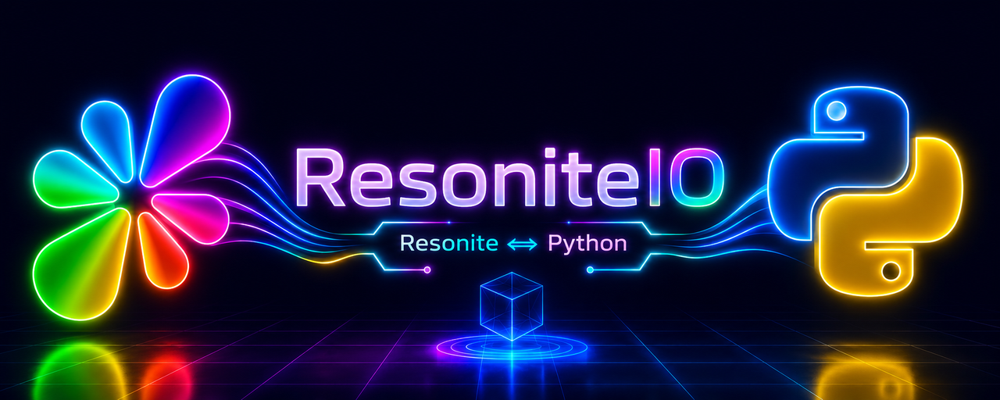

<p align="center">
  
</p>

<h1 align="center">ResoniteIO</h1>

<p align="center">A bidirectional IPC bridge between <a href="https://resonite.com/">Resonite</a> and Python.</p>

<p align="center">
  <a href="https://pypi.org/project/resonite-io/"></a>
  <a href="https://pypi.org/project/resonite-io/"></a>
  
  <a href="LICENSE"></a>
  <a href="https://github.com/MLShukai/ResoniteIO/actions/workflows/test.yml"></a>
  <a href="https://github.com/MLShukai/ResoniteIO/actions/workflows/type-check.yml"></a>
  <a href="https://github.com/MLShukai/ResoniteIO/actions/workflows/dotnet.yml"></a>
</p>

______________________________________________________________________

**ResoniteIO** is a bidirectional IPC bridge that lets your Python code observe and control
[Resonite](https://resonite.com/): capture video and audio out of the client, and send audio,
movement, and UI input back in. A C# mod runs inside the Resonite client and a Python package
(`resoio`) runs wherever your code lives; they talk to each other over **gRPC on a Unix Domain
Socket**.

Each capability is exposed as an independent, asynchronous **modality** stream carrying its
own timestamps. There is no global clock or `step()` barrier — any synchronization you need
is done on the receiving side, and you can use any modality on its own.

## Modalities

| Direction          | Modalities                                                                                                                                 |
| ------------------ | ------------------------------------------------------------------------------------------------------------------------------------------ |
| Resonite → Python  | **Camera**, **Speaker** (server-streaming: vision and audio out)                                                                           |
| Python → Resonite  | **Microphone**, **Locomotion** (client-streaming: voice in, movement)                                                                      |
| Request / response | **Connection**, **Info**, **Grabber**, **Display**, **World**, **ContextMenu**, **Dash**, **Inventory**, **Cursor**, **Lifecycle** (unary) |

## Installation

> **Linux only.** ResoniteIO targets Resonite running on Linux through Steam Play (Proton)
> and communicates over a Unix Domain Socket. Windows is not supported, and there are no
> plans to support it.

ResoniteIO has two halves that install separately and connect over a Unix Domain Socket.

**1. The mod** (runs inside Resonite) — download the latest mod zip from
[GitHub Releases](https://github.com/MLShukai/ResoniteIO/releases) and import it into a mod
manager such as [Gale](https://github.com/Kesomannen/gale) via **Import > Local mod...**, then
set the Steam launch option `WINEDLLOVERRIDES="winhttp=n,b" %command%` (required — see the
[installation guide](https://mlshukai.github.io/ResoniteIO/latest/getting-started/installation/)
for the supporting plugins you must install first). Grab the newest build in one command:

```bash
curl -L -o ResoniteIO.zip https://github.com/MLShukai/ResoniteIO/releases/latest/download/ResoniteIO.zip
# or: wget -O ResoniteIO.zip https://github.com/MLShukai/ResoniteIO/releases/latest/download/ResoniteIO.zip
```

**2. The Python client** (runs with your code):

```bash
pip install resonite-io
```

See the **[Installation guide](https://mlshukai.github.io/ResoniteIO/latest/getting-started/installation/)**
for the full setup, including the required supporting plugins.

## Quick start

With the mod deployed and Resonite running (on the host via Steam, or — for vanilla
Resonite — inside the dev container with `just resonite-up`):

```python
import asyncio

from resoio import ConnectionClient


async def main() -> None:
    async with ConnectionClient() as client:
        response = await client.ping("hello")
        print(response.message)


asyncio.run(main())
```

Or from the command line:

```bash
resoio ping --message hello
resoio record --video out.mp4     # capture the Camera modality to a file
```

See the **[Quick Start guide](https://mlshukai.github.io/ResoniteIO/latest/getting-started/quickstart/)**
for streaming examples.

## Documentation

Full documentation — installation, architecture, every modality, the Python API reference,
and the CLI — lives at **<https://mlshukai.github.io/ResoniteIO/>**.

## Contributing

Development setup, the dev container, and the build/test workflow are documented in
[CONTRIBUTING.md](CONTRIBUTING.md).

## License

[MIT](LICENSE)
