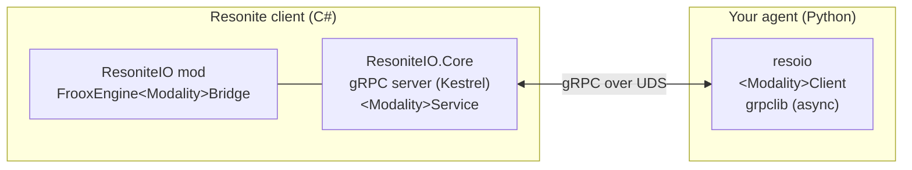

# Architecture Overview

ResoniteIO connects two processes — the Resonite client and your agent code — over gRPC on
a Unix Domain Socket (UDS).

## Why gRPC over UDS

- **gRPC** gives a typed, multi-language contract with first-class streaming, which maps
  cleanly onto the streaming modalities (Camera, Speaker, Microphone, Locomotion).
- **A Unix Domain Socket** keeps the transport local and avoids exposing a TCP port. The
  socket lives under `~/.resonite-io/` for production IPC and `~/.resonite-io-debug/` for the
  debug bridge. (Under Steam/Proton, `/run/user/<UID>` and `/tmp` are not shared with the
  game's filesystem namespace, which is why a `$HOME`-rooted path is used.)

## proto is the single source of truth

The wire contract lives in `proto/resonite_io/v1/*.proto`, one file per modality. Code is
generated from it on both sides:

- **C#**: generated at build time by `Grpc.Tools` (server stubs only; not committed).
- **Python**: generated by `betterproto2` into `python/src/resoio/_generated/` and **committed**.

Regenerate the Python side with `just gen-proto` whenever a `.proto` changes.

## Core/Mod two-layer design

The C# code is deliberately split so that almost all logic is testable without Resonite:

| Layer | Project | Responsibility |
| --- | --- | --- |
| Core | `ResoniteIO.Core` | gRPC server, `<Modality>Service`, proto mapping, domain logic. **No Resonite dependency.** |
| Mod | `ResoniteIO` | BepInEx plugin: starts the server on engine ready, and the `FrooxEngine<Modality>Bridge` engine adapters. |

The dependency direction is strictly **Core ← Mod**; Core never references the mod. Each
service talks to the engine only through a `I<Modality>Bridge` interface, so Core tests can
inject a fake bridge and exercise the full Kestrel round-trip over a real UDS. See the
[C# Mod](csharp-mod.md) page for details.

## Timestamps instead of a global clock

There is no global clock or barrier. Each stream stamps its frames with UTC nanoseconds
(server-side `UnixNanosClock`), and any cross-modality synchronization is the receiver's
responsibility. This keeps modalities fully independent — you can use just one without the
others.
